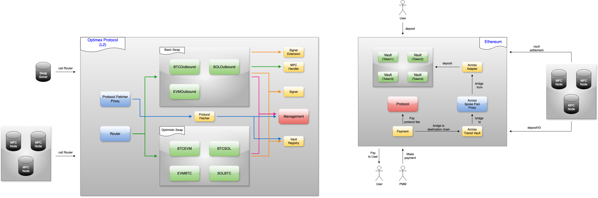

### Optimex Protocol Overview (SMC)

#### Protocol Features

1.  Cross-Chain Compatibility: The `Optimex Protocol` is designed to operate seamlessly across multiple networks, enabling a wide range of asset interactions.

2.  Scalability: Utilizing a private L2 network enhances the protocol's scalability, allowing for higher transaction throughput and lower fees.

3.  Security: Established cryptographic methods and proven smart contract patterns strengthen the security of user transactions and protocol operations.

#### Deployed Contracts:

- `Ethereum`:
  - `Payment`: [0x0A497AC4261E37FA4062762C23Cf3cB642C839b8](https://etherscan.io/address/0x0A497AC4261E37FA4062762C23Cf3cB642C839b8)
  - `ETHVault`: [0xF7fedF4A250157010807E6eA60258E3B768149Ff](https://etherscan.io/address/0xF7fedF4A250157010807E6eA60258E3B768149Ff)
  - `WETHVault`: [0xaD3f379AaED8Eca895209Af446F2e34f07145dbC](https://etherscan.io/address/0xaD3f379AaED8Eca895209Af446F2e34f07145dbC)
  - `USDTVault`: [0x0712CAB9e52a37aFC6fA768b20cc9b07325314fB](https://etherscan.io/address/0x0712CAB9e52a37aFC6fA768b20cc9b07325314fB)
  - `USDCVault`: [0x4463084C01ed22E8320D345b357721aE525Db93F](https://etherscan.io/address/0x4463084C01ed22E8320D345b357721aE525Db93F)
  - `WBTCVault`: [0xCd6B5F600559104Ee19320B9F9C3b2c7672cb895](https://etherscan.io/address/0xCd6B5F600559104Ee19320B9F9C3b2c7672cb895)
