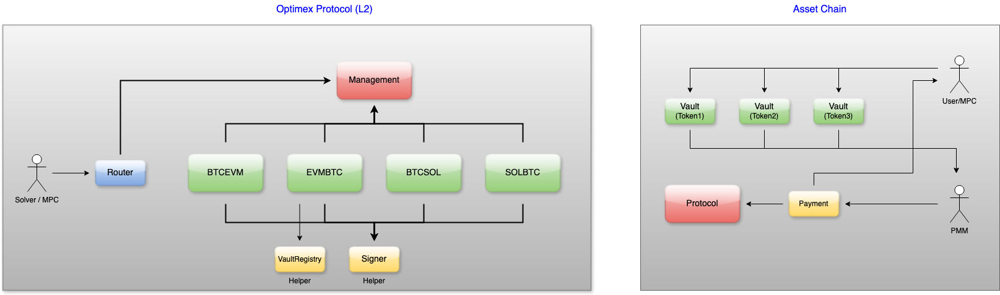

### Optimex Protocol Overview (SMC)

The `Optimex Protocol` is a robust framework designed to facilitate cross-chain transactions and interactions in a decentralized finance (`DeFi`) environment. It utilizes a series of smart contracts deployed across different networks to ensure secure, efficient, and scalable operations. The protocol comprises several key components, deployed in both a private L2 network and across asset-chains (i.e. Ethereum, Base)

  

All of the following contracts are designed to be replaceable (compose/decompose).

#### Protocol Features

1.  Cross-Chain Compatibility: The `Optimex Protocol` is designed to operate seamlessly across multiple networks, including Ethereum and Base, enabling a diverse range of asset interactions.

2.  Scalability: Utilizing a private L2 network enhances the protocol's scalability, allowing for higher transaction throughput and lower fees.

3.  Security: The use of established cryptographic methods and smart contract patterns enhances the security of user transactions and protocol operations.

#### Optimex Protocol (L2)

###### `Management` contract

This contract functions as the mini-governance system of the Optimex Protocol.

- Manages the Protocol Fee Rate (`pFeeRate`)
- Manage a list of authorized `Solver`.
  - Each of `Solver` can have one or more associated accounts.
  - Whitelisted accounts are granted the privilege to call certain functions:
    - `submitTrade`
    - `selectPMM`
    - `makePayment`
- Manages a list of authorized MPC Nodes.
  - Each Node can have one or more associated accounts.
  - Whitelisted accounts are granted the privilege to call certain functions (with the required signature):
    - `confirmDeposit`
    - `confirmPayment`
    - `confirmSettlement`
- Manages the list of supported networks and tokens on each network.
- Manages the list of MPC public keys and their associated addresses derived from `mpcL2Pubkey`.
  - In most case, there is only one public key pair (`mpcAssetPubkey` and `mpcL2Pubkey`) available for one `networkId`.
  - DApp or `Solver` can retrieve this information by checking `getLatestMPCInfo()`.
  - Also provides a function to check a public key's availability (`isValidPubkey()`).
  - Offers an alternative way to validate a non-latest public key via `getMPCInfo`, which returns:
    - The `mpcL2Address` derived from the `mpcL2Pubkey`.
    - Its `expireTime`.
    - The `mpcL2Pubkey` and `mpcAssetPubkey`.
- Manages the list of supported PMMs and their associated accounts.
  - Each PMM can have one or more associated accounts.
  - The L2 contract uses these addresses to validate PMM signatures.
- Manages the Optimex Protocol status:
  - `Operation`: protocol fully operational.
  - `Suspend`: protocol is in suspension mode.
    - `submitTrade`, `confirmDeposit`, and `selectPMM` are suspended.
    - `makePayment`, `confirmPayment`, and `confirmSettlement` continue to operate normally.
  - `Shutdown`: protocol is in shutdown mode.
    - All trades (in-progress or new) are suspended.
    - Configuration actions related to `Management` continue to function normally.

###### `BTCEVM` and `EVMBTC` contract:

These contracts facilitate trades/swaps between the Bitcoin Network and EVM-compatible networks. (and vice versa)

- Tracks the current stage of each trade (`currentStage(tradeId)`).
  - Once submitted, trades progress to the next stage.
  - No updates are allowed after submission, except for `makePayment`.
- Restricts authentication based on the trade stage:
  - `submitTrade`, `selectPMM`:
    - Caller must possess the `Solver` role.
    - Requests are initiated through the `Router` contract.
  - `makePayment`:
    - Caller/Requester must be either:
      - A `Solver` involved in the trade, or
      - A selected PMM's associated account.
    - Requests are routed via the `Router` contract's `bundlePayment` function.
    - `paymentTxId` can be updated as long as it has not yet been confirmed by the `MPC`.
  - `confirmDeposit`, `confirmPayment`, and `confirmSettlement`:
    - Exclusively callable by `MPCNode` using a valid signature.
    - Requests must pass through the `Router` contract.
- Records the proof submitted for each stage.
  - `trade(tradeId)`: retrieves `sessionId`, `tradeInfo` and `scriptInfo`
  - `presign(tradeId)`: retrieves presign information.
  - `depositAddressList(tradeId)`: retrieves the list of addresses used to transfer funds into the `vault`/`utxoAddress`
  - `pmmSelection(tradeId)`: retrieves selected PMM information, including `rfqInfo` and `selectedPMMInfo`
  - `feeDetails(tradeId)`: Retrieves a breakdown of the fee details
  - `affiliate(tradeId)`: Retrieves affiliate information, including the aggregated affiliate fee rate and other relevant details
  - `settledPayment(tradeId)`: retrieves `paymentTxHash` along with its confirmation status (`isConfirmed`), and `releaseTxHash`
- Supports multiple networks:
  - `BTCEVM`: handles trades from the `Bitcoin` network to EVM-compatible networks (i.e. `Ethereum`, `Base`, `Optimism`).
  - `EVMBTC`: handles trades from EVM-compatible networks (i.e. `Ethereum`, `Base`, `Optimism`) to the `Bitcoin` network.

###### `BTCSOL` and `SOLBTC` contract:

These contracts facilitate trades/swaps between the Bitcoin Network and Solana Network. (and vice versa)

- Tracks the current stage of each trade (`currentStage(tradeId)`).
  - Once submitted, trades progress to the next stage.
  - No updates are allowed after submission, except for `makePayment`.
- Restricts authentication based on the trade stage:
  - `submitTrade`, `selectPMM`:
    - Caller must possess the `Solver` role.
    - Requests are initiated through the `Router` contract.
  - `makePayment`:
    - Caller/Requester must be either:
      - A `Solver` involved in the trade, or
      - A selected PMM's associated account.
    - Requests are routed via the `Router` contract's `bundlePayment` function.
    - `paymentTxId` can be updated as long as it has not yet been confirmed by the `MPC`.
  - `confirmDeposit`, `confirmPayment`, and `confirmSettlement`:
    - Exclusively callable by `MPCNode` using a valid signature.
    - Requests must pass through the `Router` contract.
- Records the proof submitted for each stage.
  - `trade(tradeId)`: retrieves `sessionId`, `tradeInfo` and `scriptInfo`
  - `presign(tradeId)`: retrieves presign information.
  - `depositAddressList(tradeId)`: retrieves the list of addresses used to transfer funds into the `vault`/`utxoAddress`
  - `pmmSelection(tradeId)`: retrieves selected PMM information, including `rfqInfo` and `selectedPMMInfo`
  - `feeDetails(tradeId)`: Retrieves a breakdown of the fee details
  - `affiliate(tradeId)`: Retrieves affiliate information, including the aggregated affiliate fee rate and other relevant details
  - `settledPayment(tradeId)`: retrieves `paymentTxHash` along with its confirmation status (`isConfirmed`), and `releaseTxHash`
- Supports multiple networks:
  - `BTCSOL`: handles trades from the `Bitcoin` network to `Solana` network.
  - `SOLBTC`: handles trades from the `Solana` network to the `Bitcoin` network.

###### `Router` contract:

This contract serves as the `Router` that directs submissions to the appropriate handling contracts (`BTCEVM`, `EVMBTC`, `BTCSOL`, or `SOLBTC`)

- Admins manage routes by calling `setRoute`.
- Each route is represented by a `routingHash`, created by `keccak256(fromChain, toChain)`
- Example:
  - `Bitcoin` to `Ethereum`: `hash(Bitcoin, Ethereum)` => `BTCEVM` contract
  - `Bitcoin` to `Optimism`: `hash(Bitcoin, Optimism)` => `BTCEVM` contract
  - `Ethereum` to `Bitcoin`: `hash(Ethereum, Bitcoin)` => `EVMBTC` contract
  - `Optimism` to `Bitcoin`: `hash(Optimism, Bitcoin)` => `EVMBTC` contract
- Supports routing to the latest version of `BTCEVM` or `EVMBTC` without affecting in-progress trades.
  - Trade 1 (`submitTrade`) -> `Solver` -> `Router` -> `BTCEVM` (v1)
  - Trade 1 (with `tradeId`) will be mapped to `BTCEVM` (v1)
  - A new version of the `BTCEVM` contract (v2) is deployed, and the route is updated.
  - Trade 2 (`submitTrade`) -> `Solver` -> `Router` -> `BTCEVM` (v2)
  - Trade 1 (`confirmDeposit`) -> `Solver` -> `Router` (using `tradeIdToCore`) -> `BTCEVM` (v1)

Also provide query interfaces:

- Provides interfaces to query trade-related information:
  - `getCurrentStage()`, `getFeeDetails()`, `getSettledPayment()`, `getAffiliateInfo()`
  - `getTradeData()`, `getPresigns()`, `getDepositAddressList`, and `getPMMSelection`
  - `getLastSignedPayment()`
- Provides interfaces to query protocol settings:
  - `getManagementOwner()`, `getPFeeRate()`, `getProtocolState()`, `isSuspended()`
  - `getLatestMPCInfo()`, `getMPCInfo()`, `isValidPubkey()`
  - `numOfSupportedTokens()`, `getTokens()`, `isValidNetwork()`, `isValidToken()`
  - `isSolver()`, `isMPCNode()`, `isValidPMM()`, `isValidPMMAccount()`

###### `VaultRegistry` contract:

The `VaultRegistry` contract functions as a `Helper` within the `Optimex Protocol` to validate and manage `vaultAddress` entries across various asset chains. It plays a key role in ensuring that `Vault` contracts are accurately registered and updated for specific tokens.

- Purpose:
  - Validates the `vaultAddress` for tokens on asset chains.
  - Allows for administrative updates of `Vault` contracts to maintain an accurate registry.
- Administrative Functionality: `setVault(address vault, bytes networkId, bytes tokenId)`
  - This function enables the Optimex Protocol's Admin to:
    - Register or update the deployed `Vault` for a specific token.
    - Associate the `vaultAddress` with its corresponding `networkId` and `tokenId`.
  - Ensures that each asset chain's locking mechanism for a token is properly managed.

###### `Signer` contract:

This is a `Helper` contract that assists in retrieving the `Signer` for each signature type. The supported signature types include:

- `Presign`
- `ConfirmDeposit`
- `Selection` (PMM selection)
- `Authentication` (RFQ Authentication)
- `MakePayment` (PMM makes a payment, then either Solver or PMM submits `paymentTxId`)
- `ConfirmPayment`
- `ConfirmSettlement`

#### Asset-Chain Contracts

###### `Protocol` contract:

This contract is used as the Optimex Protocol Contract across various asset chains.

- Manages the Owner, who has special privileges to upgrade settings.
- Manages the Protocol Fee Receiver.

###### `Payment` contract:

This contract is used as the Optimex Protocol Contract across various asset chains.

- Supports PMM in settling payments to users.
- Splits the payment into two destinations:
  - To the user.
  - To the Protocol Fee Receiver.

###### `NativeVault` and `TokenVault` contracts:

These contracts are used as the Optimex Contract across various asset chains.

- Handles the necessary logic for depositing funds, settling payments, and issuing refunds.
- `NativeVault` contract:
  - The contract is tailored to handle deposits of native coins (e.g., ETH, MATIC) for a specified `tradeId`. It exclusively manages native coins as locking tokens.
  - Provides an interface for depositing native coins into the Vault, linked to a unique `tradeId`.
  - Ensures secure storage and tracking of native coin deposits per `tradeId`.
- `TokenVault` contract:
  - The contract facilitates deposits of a specific ERC-20 token for a specified `tradeId`. It is designed to support one type of ERC-20 token per deployment.
  - Provides an interface for depositing a specific `ERC-20 token` into the Vault, associated with a unique `tradeId`.
  - Allows secure and traceable management of ERC-20 token deposits.
  - Modular design ensures that a new Vault can be deployed for each type of ERC-20 token required.
